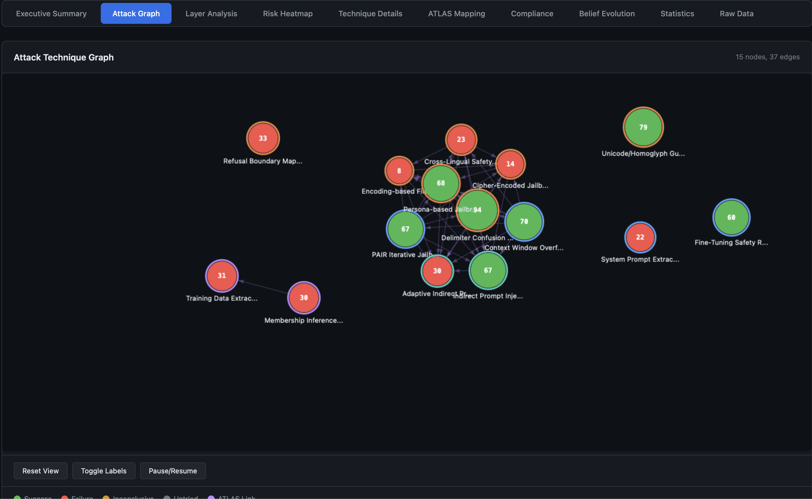

# Adversarial Attack Sequencing for AI Systems

## Why Single-Technique Testing Falls Short

Most AI red teaming tools evaluate attack techniques in isolation: run a jailbreak probe, record pass or fail, move to the next one. This misses a fundamental reality of adversarial attacks - **techniques chain together**.

A real attacker does not randomly pick from a menu. They follow a logical sequence:

1. **Recon**: Extract the system prompt to understand filtering rules
2. **Probe**: Test encoding bypasses to identify which filters are weakest
3. **Exploit**: Craft a multi-turn jailbreak that routes through the discovered gap

Each step informs the next. The probability of step 3 succeeding changes dramatically based on what was learned in steps 1 and 2.

AdversaryPilot models these dependencies explicitly through **attack path analysis** - computing joint success probabilities across multi-stage attack sequences.

## What is Attack Sequencing?

Attack sequencing is the process of ordering adversarial techniques into a logical chain where each technique's prerequisites are satisfied by earlier techniques in the sequence. AdversaryPilot's `ChainPlanner` generates these sequences automatically based on technique metadata and Bayesian posteriors.

A sequence has three properties:

- **Dependency ordering**: Each technique's prerequisites are satisfied by earlier stages
- **Joint probability**: The probability that the entire chain succeeds, computed as the product of individual probabilities (adjusted for conditional dependencies)
- **Attack narrative**: A human-readable description of the attack story for reports

## Attack Path Analysis with Beam Search

AdversaryPilot uses **beam search** to explore the space of possible attack chains efficiently. Instead of evaluating every permutation of techniques (combinatorially explosive), beam search maintains the top-K most promising partial chains at each step.

The algorithm:

1. **Initialize** with techniques that have no prerequisites (recon techniques, low-cost probes)
2. **Expand** each partial chain by appending compatible techniques whose prerequisites are now satisfied
3. **Score** each expanded chain by its joint success probability
4. **Prune** to the top-K chains (beam width)
5. **Repeat** until chains reach the maximum depth or no more techniques can be appended

This produces a ranked list of attack paths, each with a probability and a narrative.

## Joint Success Probability Calculation

The joint probability of a chain is the product of individual technique success probabilities, where each probability is drawn from the technique's current Bayesian posterior:

```
P(chain) = P(step_1) * P(step_2 | step_1) * P(step_3 | step_1, step_2)
```

In practice, AdversaryPilot approximates conditional probabilities using **family correlation** - if step 1 succeeds and step 2 is in a related technique family, step 2's posterior receives a correlation boost.

### Worked Example

Consider an attack chain against a black-box chatbot with input filtering and moderation:

```
Step 1: System Prompt Extraction
  P(success) = 0.72 (strong prior from benchmarks, high fit for chatbot)
  Rationale: Extract hidden instructions to identify filtering gaps

Step 2: Encoding Bypass (Base64)
  P(success | step 1) = 0.58 (conditional on knowing the system prompt)
  Rationale: System prompt reveals which encodings are not filtered

Step 3: Direct Prompt Injection via Encoding
  P(success | steps 1,2) = 0.34 (conditional on identified bypass route)
  Rationale: Inject instructions using the discovered encoding gap

Joint P(success) = 0.72 * 0.58 * 0.34 = 0.142 (14.2%)
```

A 14.2% joint probability might seem low, but consider:

- Each step independently provides valuable intelligence
- The chain has only 3 steps - longer chains have exponentially lower joint probabilities
- A 14.2% probability over 500 allowed queries means approximately 71 expected successful completions

AdversaryPilot generates these chains with the `chains` command:

```bash
adversarypilot chains target.yaml
```

## Technique Dependency Graphs

Each technique in AdversaryPilot's [70-technique catalog]({{ '/mitre-atlas-ai-red-teaming-planner/' | relative_url }}) includes a `prerequisites` field listing techniques or conditions that should be satisfied first.

Common dependency patterns:

| Chain Type | Pattern | Example |
|------------|---------|---------|
| **Recon → Exploit** | Extract information, then exploit it | System prompt extraction → targeted prompt injection |
| **Probe → Bypass → Exploit** | Find a gap, create a route, use it | Filter probing → encoding bypass → payload delivery |
| **Extraction → Extraction** | Chain extraction steps | System prompt extraction → training data extraction |
| **Tool → Action** | Gain tool access, then act | MCP schema injection → tool misuse induction |
| **Agent → Escalation** | Compromise one agent, spread | A2A impersonation → delegation abuse → privilege escalation |

## Two-Phase Campaigns and Sequencing

Attack sequencing integrates with AdversaryPilot's [two-phase campaign model]({{ '/ai-red-team-strategy/' | relative_url }}):

**Probe phase**: Short, independent chains (1-2 steps) that establish baseline success rates across surfaces. The planner casts a wide net.

**Exploit phase**: Longer chains (3-5 steps) that build on discovered weaknesses. Posteriors from the probe phase inform which chains are most promising.

The `campaign next` command automatically considers chain dependencies when making recommendations:

```bash
# Phase 1: Broad probing (planner recommends independent techniques)
adversarypilot campaign next <id>
# Output: System Prompt Extraction, DAN Jailbreak, MCP Schema Probe

# (after importing results where extraction succeeded)

# Phase 2: Exploit chains (planner recommends techniques that build on extraction)
adversarypilot campaign next <id>
# Output: Encoding Bypass, Indirect Prompt Injection, Context Window Overflow
```

## Generating Attack Narratives

Every chain produced by AdversaryPilot includes a human-readable narrative suitable for inclusion in security reports:

> **Attack Path: System Prompt Exploitation**
>
> The assessment begins with system prompt extraction (72% success probability based on HarmBench priors for black-box chatbots). If the system prompt reveals filtering rules, the assessor tests encoding bypasses (Base64, Unicode homoglyphs) to identify unfiltered routes (58% conditional probability). Finally, a direct prompt injection is crafted using the discovered encoding gap (34% conditional probability). The joint probability of this 3-step chain is 14.2%, representing a moderate-confidence attack path that yields high-value intelligence at each stage.

These narratives are included in the HTML report under the Attack Graph tab.



## How AdversaryPilot Sequences Attacks

```bash
# Generate attack chains for a target
adversarypilot chains target.yaml

# Output: ranked chains with probabilities and narratives
# Chain 1: Extract → Bypass → Inject (P=0.142)
# Chain 2: Probe Moderation → Crescendo Multi-Turn (P=0.198)
# Chain 3: MCP Schema Probe → Tool Misuse → Data Exfiltration (P=0.087)

# Generate a full attack plan (includes chain-aware sequencing)
adversarypilot plan target.yaml

# Run a campaign that adapts chain recommendations based on results
adversarypilot campaign new target.yaml --name "chain-assessment"
adversarypilot campaign next <id>
```

## Related Pages

- [AI Red Team Strategy]({{ '/ai-red-team-strategy/' | relative_url }}) - The two-phase campaign model and Bayesian prioritization
- [What is AdversaryPilot?]({{ '/what-is-adversarypilot/' | relative_url }}) - How Thompson Sampling drives decisions
- [MITRE ATLAS Red Teaming Planner]({{ '/mitre-atlas-ai-red-teaming-planner/' | relative_url }}) - Full catalog of 70 techniques with dependency metadata
- [Promptfoo Attack Planning]({{ '/promptfoo-attack-planning/' | relative_url }}) - Execute sequenced attacks with promptfoo
