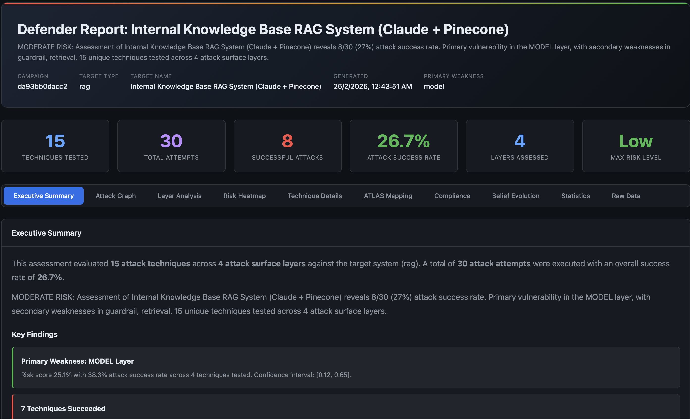

# Analyzing Garak Results with AdversaryPilot

## What is Garak?

[Garak](https://github.com/NVIDIA/garak) (Generative AI Red-teaming & Assessment Kit) is NVIDIA's open-source tool for probing LLM vulnerabilities. It includes 100+ probes covering jailbreaks, prompt injection, data leakage, hallucination, and more. Garak outputs results as JSONL logs with per-probe pass/fail rates.

Garak excels at **running** probes. What it does not do is:

- Tell you which probes to run next based on results so far
- Calibrate results against benchmark baselines
- Map findings to compliance frameworks (OWASP, NIST, EU AI Act)
- Track Bayesian posteriors across a multi-session assessment
- Generate compliance-ready reports for stakeholders

AdversaryPilot fills this gap. Import garak results, get statistical analysis, and receive data-driven recommendations for what to test next.

## How AdversaryPilot Imports Garak Results

The import command reads garak's JSONL output and maps each probe to an AdversaryPilot technique:

```bash
adversarypilot import garak garak_report.jsonl
```

The importer:

1. Parses each JSONL line for probe name, result, and confidence
2. Maps the garak probe to an AdversaryPilot technique ID using the 27-probe mapping table
3. Creates `AttemptResult` and `EvaluationResult` records
4. Updates the campaign's Bayesian posteriors with the new observations
5. Triggers family correlation updates (success on one jailbreak boosts related techniques)

## 27 Garak Probe-to-Technique Mappings

AdversaryPilot maps 27 garak probes to its ATLAS-aligned technique catalog:

### Jailbreak Probes

| Garak Probe | AdversaryPilot Technique | ATLAS Ref |
|-------------|------------------------|-----------|
| `probes.dan.Dan_6_0` | DAN Jailbreak | AML.T0051 |
| `probes.dan.Dan_11_0` | DAN Jailbreak | AML.T0051 |
| `probes.dan.Dan_Jailbreak` | DAN Jailbreak | AML.T0051 |
| `probes.dan.DUDE` | Persona-based Jailbreak | AML.T0051 |
| `probes.dan.STAN` | Persona-based Jailbreak | AML.T0051 |

### Encoding and Bypass Probes

| Garak Probe | AdversaryPilot Technique | ATLAS Ref |
|-------------|------------------------|-----------|
| `probes.encoding.InjectBase64` | Encoding Bypass (Base64) | AML.T0051 |
| `probes.encoding.InjectROT13` | Encoding Bypass | AML.T0051 |
| `probes.encoding.InjectMorse` | Encoding Bypass | AML.T0051 |
| `probes.encoding.InjectHex` | Encoding Bypass | AML.T0051 |
| `probes.encoding.InjectBraille` | Encoding Bypass | AML.T0051 |

### Prompt Injection Probes

| Garak Probe | AdversaryPilot Technique | ATLAS Ref |
|-------------|------------------------|-----------|
| `probes.promptinject.HijackHateHumansMini` | Direct Prompt Injection | AML.T0051 |
| `probes.promptinject.HijackKillHumansMini` | Direct Prompt Injection | AML.T0051 |
| `probes.promptinject.HijackLongPrompt` | Direct Prompt Injection | AML.T0051 |

### Extraction and Leakage Probes

| Garak Probe | AdversaryPilot Technique | ATLAS Ref |
|-------------|------------------------|-----------|
| `probes.leakreplay.LiteraryRecitation` | Training Data Extraction | AML.T0024 |
| `probes.leakreplay.GuardianCloze` | Training Data Extraction | AML.T0024 |
| `probes.leakreplay.PotterComplete` | Training Data Extraction | AML.T0024 |

### Hallucination and Reliability Probes

| Garak Probe | AdversaryPilot Technique | ATLAS Ref |
|-------------|------------------------|-----------|
| `probes.snowball.GraphConnectivity` | Hallucination Elicitation | AML.T0048 |
| `probes.snowball.MathProof` | Hallucination Elicitation | AML.T0048 |
| `probes.snowball.Primes` | Hallucination Elicitation | AML.T0048 |
| `probes.goodside.Tag` | Instruction Following Exploit | AML.T0051 |
| `probes.goodside.WhoIsRiley` | System Prompt Extraction | AML.T0051 |

## From Raw Scores to Bayesian Intelligence

Garak gives you probe-level pass/fail rates. AdversaryPilot transforms these into actionable intelligence through three layers of analysis:

### Layer 1: Posterior Updates

Each imported result updates the Beta(alpha, beta) posterior for the corresponding technique:

- **Success** (probe passed the attack): alpha increments, shifting the posterior toward higher success probability
- **Failure** (probe was defended): beta increments, shifting the posterior toward lower success probability

After import, the planner's next recommendation reflects the updated beliefs. If DAN probes succeeded, the planner may recommend related jailbreak techniques (Crescendo, PAIR) that benefit from family correlation. If they failed, it shifts attention to other surfaces.

### Layer 2: Z-Score Calibration

Raw attack success rates are uninterpretable without context. AdversaryPilot calibrates garak results against published baselines from HarmBench and JailbreakBench:

```
Z-score = (observed_ASR - benchmark_mean) / benchmark_std
```

What this tells you:

| Z-Score | Interpretation |
|---------|---------------|
| Z > 2.0 | Target is significantly weaker than benchmark - critical finding |
| 1.0 < Z < 2.0 | Target is weaker than average - notable finding |
| -1.0 < Z < 1.0 | Target performs within normal range |
| Z < -1.0 | Target is stronger than average - good defense |
| Z < -2.0 | Target is significantly stronger than benchmark |

A garak DAN probe that achieves 60% ASR might seem high, but if the HarmBench baseline for DAN against similar models is 55% +/- 12%, the Z-score is only 0.42 - within normal range. This prevents false alarms and focuses attention on genuinely anomalous findings.

### Layer 3: Compliance Mapping

Every garak probe, once mapped to an AdversaryPilot technique, inherits the technique's compliance references:

| Garak Probe Category | OWASP LLM Control | Status After Import |
|---------------------|-------------------|---------------------|
| DAN / Jailbreak | LLM01 (Prompt Injection) | Tested |
| Encoding bypass | LLM01 (Prompt Injection) | Tested |
| Prompt injection | LLM01 (Prompt Injection) | Tested |
| Data leakage | LLM06 (Sensitive Information) | Tested |
| Hallucination | LLM09 (Overreliance) | Tested |

The compliance dashboard shows which controls are now covered by garak results and which still have gaps that need testing through other tools or manual assessment.



## Step-by-Step Workflow: Garak + AdversaryPilot

```bash
# 1. Create a campaign
adversarypilot campaign new target.yaml --name "garak-assessment"

# 2. Get initial recommendations (AdversaryPilot tells you what to run)
adversarypilot campaign next <campaign-id>
# Output includes garak execution hooks:
#   Run: garak --model_type openai --probes probes.dan.Dan_6_0
#   Run: garak --model_type openai --probes probes.encoding.InjectBase64

# 3. Run the recommended garak probes
garak --model_type openai \
 --model_name gpt-4 \
 --probes probes.dan.Dan_6_0

# 4. Import results
adversarypilot import garak garak_report.jsonl

# 5. Get updated recommendations (posteriors have shifted)
adversarypilot campaign next <campaign-id>
# New recommendations account for what was learned

# 6. Repeat steps 3-5 until coverage goals are met

# 7. Generate the report
adversarypilot report <campaign-id>
# Produces HTML report with garak findings mapped to ATLAS + compliance
```

## What You Get That Garak Alone Does Not Provide

| Capability | Garak Alone | Garak + AdversaryPilot |
|-----------|-------------|----------------------|
| Run probes | Yes | Yes (with execution hooks) |
| Which probe to run next | Manual choice | Bayesian recommendation |
| Statistical calibration | Z-score vs reference models | Z-score vs HarmBench/JailbreakBench |
| Compliance coverage | None | OWASP + NIST + EU AI Act |
| Cross-technique learning | None | Family correlation updates |
| Multi-session memory | None | Posterior persistence across sessions |
| Stakeholder reports | JSONL logs | 10-tab HTML report |
| Attack path analysis | None | Chain planning with joint probabilities |

## Related Pages

- [Promptfoo Attack Planning]({{ '/promptfoo-attack-planning/' | relative_url }}) - The other supported tool integration
- [What is AdversaryPilot?]({{ '/what-is-adversarypilot/' | relative_url }}) - How the Bayesian planner works
- [AI Red Team Strategy]({{ '/ai-red-team-strategy/' | relative_url }}) - Building a systematic methodology
- [MITRE ATLAS Red Teaming Planner]({{ '/mitre-atlas-ai-red-teaming-planner/' | relative_url }}) - Full technique catalog with ATLAS cross-references
