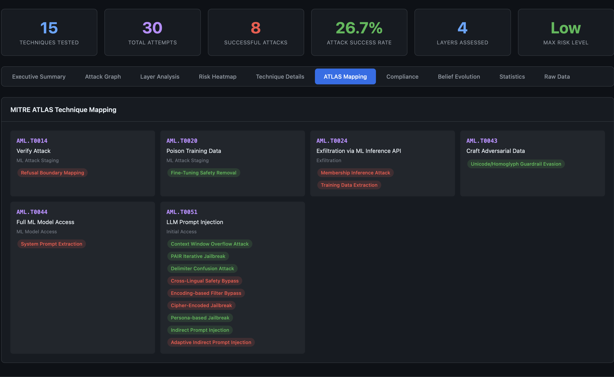
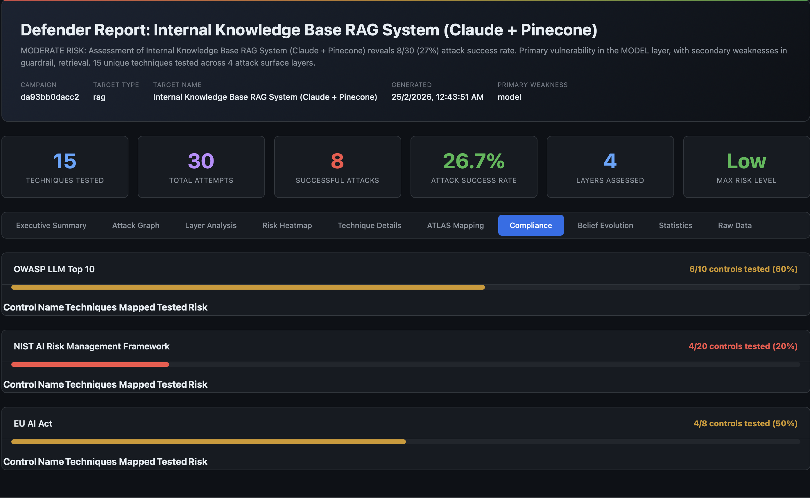

# MITRE ATLAS AI Red Teaming Planner

## What is MITRE ATLAS?

[MITRE ATLAS](https://atlas.mitre.org/) (Adversarial Threat Landscape for Artificial Intelligence Systems) is a knowledge base of adversarial tactics and techniques against AI systems. It extends the well-known [MITRE ATT&CK](https://attack.mitre.org/) framework to cover machine learning-specific threats.

ATLAS organizes AI threats into a matrix of tactics (the adversary's goals) and techniques (how they achieve those goals). Each technique has a unique identifier (e.g., `AML.T0051` for LLM Prompt Injection) and is documented with case studies, mitigations, and detection strategies.

For AI red teams, ATLAS provides a **shared vocabulary** for threat modeling and a **coverage baseline** for security assessments.

## Why ATLAS Alignment Matters for Red Teaming

Without a standardized taxonomy, red team reports describe attacks in inconsistent ways. One team calls it "jailbreaking," another calls it "safety bypass," and a third calls it "alignment evasion." ATLAS fixes this by providing canonical identifiers.

ATLAS alignment also enables:

- **Coverage measurement**: "We tested 45 of 70 ATLAS-mapped techniques" is more meaningful than "we ran some jailbreak tests"
- **Gap analysis**: Identify which ATLAS techniques were never tested
- **Cross-team comparability**: Results from different engagements can be compared on the same taxonomy
- **Compliance mapping**: ATLAS techniques map to regulatory controls (OWASP, NIST, EU AI Act)

AdversaryPilot maps all 70 of its attack techniques to MITRE ATLAS, making it the most comprehensive ATLAS-aligned red teaming planner available.

## 70 ATLAS-Mapped Techniques

### LLM Techniques (33)

AdversaryPilot covers the full spectrum of LLM attacks, from basic jailbreaks to sophisticated multi-turn and optimization-based methods.

#### Jailbreak Techniques

| Technique | ATLAS Ref | Description |
|-----------|-----------|-------------|
| DAN Jailbreak | AML.T0051 | "Do Anything Now" role-play prompt that bypasses safety training |
| Persona-based Jailbreak | AML.T0051 | Character role assignment to elicit restricted behavior |
| PAIR Iterative Jailbreak | AML.T0051 | Automated iterative refinement using an attacker LLM (Chao et al., 2023) |
| TAP Tree-of-Attacks | AML.T0051 | Tree-structured search over attack prompts (Mehrotra et al., 2023) |
| GCG Adversarial Suffix | AML.T0051 | Gradient-based adversarial suffix optimization (Zou et al., 2023) |
| AutoDAN Genetic | AML.T0051 | Genetic algorithm-optimized jailbreak prompts (Liu et al., 2023) |
| Crescendo Multi-Turn | AML.T0051 | Gradual escalation across multiple turns (Russinovich et al., 2024) |
| Skeleton Key | AML.T0051 | Master key prompt that disables safety across topics (Microsoft, 2024) |
| Few-Shot Jailbreak | AML.T0051 | In-context examples of unrestricted behavior |
| Prefix Injection | AML.T0051 | Force the model to start its response with an affirmative prefix |
| Refusal Suppression | AML.T0051 | Instructions that explicitly prohibit refusal |
| Context Window Overflow | AML.T0051 | Exploit long contexts to dilute safety instructions |

#### Prompt Injection Techniques

| Technique | ATLAS Ref | Description |
|-----------|-----------|-------------|
| Direct Prompt Injection | AML.T0051 | Inject instructions directly into the user prompt |
| Indirect Prompt Injection | AML.T0051.001 | Embed instructions in external content retrieved by the system |
| System Prompt Extraction | AML.T0051 | Extract hidden system prompts via reflection or completion attacks |

#### Bypass and Evasion

| Technique | ATLAS Ref | Description |
|-----------|-----------|-------------|
| Encoding Bypass (Base64) | AML.T0051 | Encode payloads in Base64 to evade text-based filters |
| Cross-Lingual Bypass | AML.T0051 | Use low-resource languages to bypass safety training |
| Token Smuggling | AML.T0051 | Split sensitive tokens across multiple inputs |
| Markdown/Code Injection | AML.T0051 | Exploit rendering of markdown or code blocks |
| Fine-Tuning Safety Removal | AML.T0040 | Remove safety alignment through fine-tuning access |

#### Data Extraction and RAG Attacks

| Technique | ATLAS Ref | Description |
|-----------|-----------|-------------|
| Training Data Extraction | AML.T0024 | Extract memorized training data through targeted prompting |
| Poisoned RAG Retrieval | AML.T0051.001 | Inject adversarial documents into the retrieval corpus |
| Embedding Space Attack | AML.T0020 | Manipulate embedding similarity to control retrieval |

### Agent Techniques (25)

The fastest-growing attack surface. AdversaryPilot covers MCP protocol attacks, A2A protocol attacks, and ATLAS October 2025 additions.

#### MCP Protocol Attacks

| Technique | ATLAS Ref | Description |
|-----------|-----------|-------------|
| MCP Tool Poisoning (Rug Pull) | AML.T0051 | Modify tool behavior after initial approval |
| MCP Schema Injection | AML.T0051 | Inject instructions via tool parameter descriptions |
| MCP Server Squatting | AML.T0051 | Impersonate legitimate MCP tool servers |
| MCP Cross-Tool Escalation | AML.T0051 | Chain tool calls to escalate from read to write access |

#### A2A Protocol Attacks

| Technique | ATLAS Ref | Description |
|-----------|-----------|-------------|
| A2A Agent Impersonation | AML.T0051 | Spoof agent identity in multi-agent systems |
| A2A Task Poisoning | AML.T0051 | Inject malicious sub-tasks into delegated workflows |
| A2A Agent Card Manipulation | AML.T0051 | Modify agent capability advertisements |
| A2A Context Leakage | AML.T0024 | Extract shared context from inter-agent communication |

#### Classic Agent Attacks

| Technique | ATLAS Ref | Description |
|-----------|-----------|-------------|
| Goal Hijacking | AML.T0051 | Redirect the agent's objective through prompt manipulation |
| Tool Misuse Induction | AML.T0051 | Trick the agent into using tools for unintended purposes |
| Delegation Abuse | AML.T0051 | Exploit multi-agent delegation to bypass access controls |
| Memory Poisoning | AML.T0051 | Corrupt the agent's persistent memory or context |
| Observation Manipulation | AML.T0051 | Alter environmental observations to mislead agent decisions |
| Chain Escape | AML.T0051 | Break out of the intended reasoning chain |
| Data Exfiltration via Agent | AML.T0024 | Use the agent's tool access to exfiltrate sensitive data |
| Privilege Escalation | AML.T0051 | Escalate from user to admin through agent capabilities |

### AML Techniques (12)

Classical adversarial machine learning attacks for models with gradient or query access.

| Technique | ATLAS Ref | Description |
|-----------|-----------|-------------|
| FGSM Evasion | AML.T0020 | Fast Gradient Sign Method - single-step gradient attack |
| PGD Evasion | AML.T0020 | Projected Gradient Descent - iterative gradient attack |
| Transfer Attack | AML.T0020 | Craft adversarial examples on a surrogate model and transfer |
| Backdoor Poisoning | AML.T0018 | Implant triggers during training that activate at inference |
| Clean-Label Poisoning | AML.T0018 | Poison training data without modifying labels |
| Model Extraction (API) | AML.T0024 | Reconstruct model parameters through API queries |
| Model Extraction (Side Channel) | AML.T0024 | Infer model details from timing, memory, or power consumption |
| Embedding Inversion | AML.T0024 | Recover input data from embedding vectors |
| Supply Chain Attack | AML.T0010 | Compromise model through dependencies, checkpoints, or pipelines |
| Feature Collision | AML.T0020 | Craft inputs that collide in feature space despite visual differences |
| Adversarial Patch | AML.T0020 | Physical-world perturbations that fool vision models |
| Membership Inference | AML.T0024 | Determine whether specific data was used in training |

## 2025 Attack Surfaces

AdversaryPilot includes techniques for emerging attack vectors not yet covered by most red teaming tools:

**A2A Protocol (Google, 2025)** - Agent-to-agent communication protocols introduce new trust boundaries. Impersonation, task poisoning, and context leakage attacks target the delegation chain between cooperating agents.

**Extended MCP (Anthropic, 2024-2025)** - Model Context Protocol tool servers can be poisoned after initial approval (rug pull), have instructions injected through schema fields, or be impersonated by squatting on legitimate server names.

**ATLAS October 2025 Additions** - Delegation abuse, memory poisoning, and observation manipulation reflect the latest ATLAS updates for agentic AI systems.

## From ATLAS Coverage to Compliance Reporting

Each ATLAS-mapped technique also cross-references compliance framework controls:

| ATLAS Technique | OWASP LLM | NIST AI RMF | EU AI Act |
|----------------|-----------|-------------|-----------|
| LLM Prompt Injection (AML.T0051) | LLM01 | MAP 1.1, MAP 1.5 | Art. 9, Art. 15 |
| Training Data Extraction (AML.T0024) | LLM06 | MEASURE 2.6 | Art. 10 |
| Model Poisoning (AML.T0018) | LLM03 | MANAGE 2.4 | Art. 10, Art. 15 |
| Supply Chain (AML.T0010) | LLM05 | GOVERN 1.4 | Art. 17 |

This triple-mapping means a single red team campaign produces coverage metrics for all three frameworks simultaneously.





## Using AdversaryPilot as Your ATLAS Planner

```bash
# List all ATLAS-aligned techniques
adversarypilot techniques list

# Filter by domain
adversarypilot techniques list --domain llm
adversarypilot techniques list --domain agent
adversarypilot techniques list --domain aml

# Filter by attack surface
adversarypilot techniques list --surface model
adversarypilot techniques list --surface tool

# Filter by attack goal
adversarypilot techniques list --goal jailbreak
adversarypilot techniques list --goal extraction

# Generate a ranked plan for your target
adversarypilot plan target.yaml

# Generate multi-stage attack chains
adversarypilot chains target.yaml
```

## Related Pages

- [What is AdversaryPilot?]({{ '/what-is-adversarypilot/' | relative_url }}) - How the Bayesian planner works
- [AI Red Team Strategy]({{ '/ai-red-team-strategy/' | relative_url }}) - Building a systematic red team methodology
- [Adversarial Attack Sequencing]({{ '/adversarial-attack-sequencing/' | relative_url }}) - Multi-stage attack paths with joint probabilities
- [Analyzing Garak Results]({{ '/garak-results-analysis/' | relative_url }}) - Import garak output for ATLAS-mapped analysis
